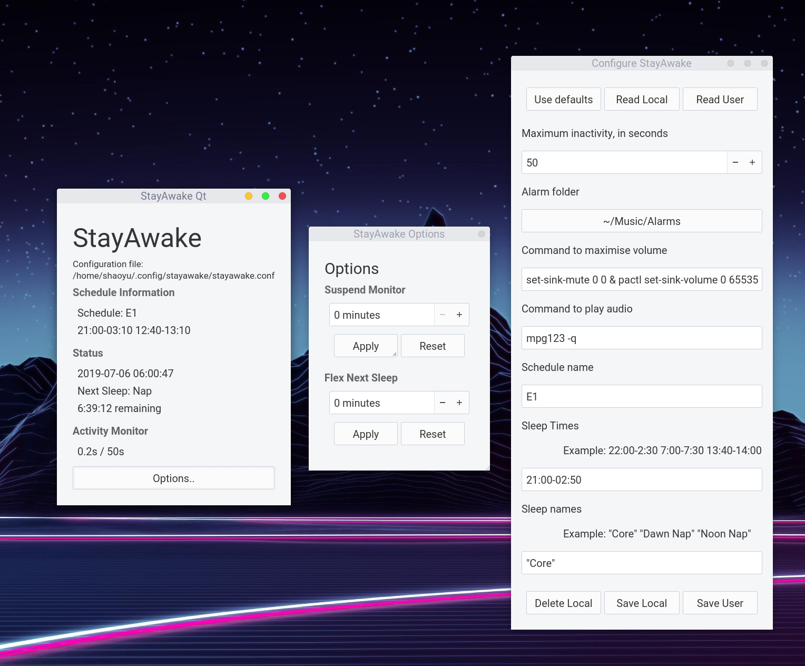

# StayAwake
Advanced wakeup alarm system written using PyQt5

### Screenshot

### Features
- Play alarms after to predefined period of inactivity
- Auto-adjust volume for playing alarms
- Log each inactivity
- Schedule dashboard
- Monitor suspend
- Move sleep times
- Automatically suspends during defined sleep times

### Prerequisites
Python 3.7
Python modules: `pynput` and `pyqt5`
`pulseaudio` is used for auto-adjusting volume on Linux(It comes by default on most systems).
On Windows, install `nircmd` and change the wakeup command to it.
`mpg123` is the default player. It is available for both Windows and Linux under LGPLv2.1.

### Setup
#### Linux from source(Recommended):  
Clone the repo, use either pip or your distro's package manager to install the dependencies, and copy `stayawake.conf.sample` to your `~/.config/stayawake/stayawake.conf` and edit it according to your needs. Alternatively, you can run `stayawake-conf.py` to configure it graphically. Place the alarm sounds in the folder specified in the config file.(default: ~/Music/alarms) StayAwake looks for the config in the following places, with fallback:  
 - The file specified with `-c CONF` CLI option
 - In the same folder as the executable(`./stayawake.conf`)
 - $HOME/.config/stayawake/stayawake.conf  
Finally, run `./stayawake-qt.py`.
You can optionally install the .desktop file into your application directory
to make stayawake available as a desktop application. Remember to change the
path to icon.

#### Windows with binary:  
Download the release binaries and extract the folder. Run 'stayawake-conf.exe' to configure StayAwake. "Save local" means to save the config file in the same folder as the executable and "Save user" means to save the file in your user config folder. You can only have a one user config, but any number of local configs. StayAwake always tries to read the local config first. The user config file will only be read when there is no file named 'stayawake.conf' in the same folder as the executable.
 
### Alarm Sounds
You can select files from [this](https://www.dropbox.com/s/dihn9m58wfnyxwk/alarm.rar) which is linked to by the now-abandoned [NMO](https://github.com/PolyphasicDevTeam/NoMoreOversleeps). Choose shorter alarms over longer ones.

### Safety Warning
Please note that I am in NO WAY responsible over ANY damage caused to you through the use of this tool. You are recommended to do something other than using a computer if you still fall asleep after several alarms. Repeated use of sound alarms might cause hearing damage and/or tolerance to alarms. YOU HAVE BEEN WARNED. 

### Known Issues:
- May not work on Wayland:
    This program depends on pynput to detect input activity, which does not include full wayland support yet. This might change in the future.
- `Xlib.error.DisplayConnectionError: Can't connect to display ":0": b'Invalid MIT-MAGIC-COOKIE-1 key'`
    This appears to be a pynput bug. For the time being, use `xhost +` command
to circumvent this.
### Report a Bug
If you encounter any problems, please submit an issue.  
If you really don't know how to use github, you can send a message to
zandimna#3117 on Discord.
Try to provide the following information:  
- Your operating system
- Your python version
- Steps to reproduce
- The output with `-v` option
- Your config file

